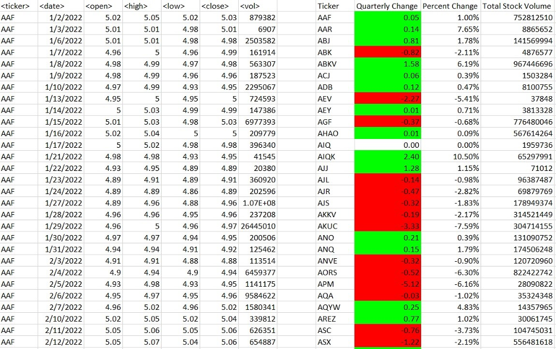
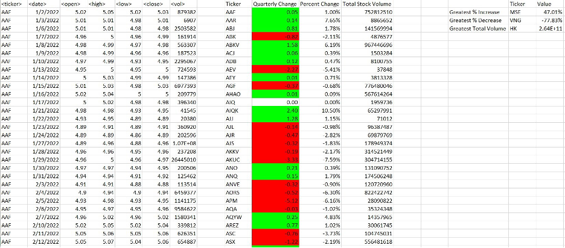

# VBA-challenge

## Background
You are well on your way to becoming a programmer and Excel expert! In this homework assignment, you will use VBA scripting to analyze generated stock market data.  

## Before You Begin
Create a new repository for this project called VBA-challenge.  
Do not add this assignment to an existing repository.  
Inside the new repository that you just created, add any VBA files that you use for this assignment. These will be the main scripts to run for each analysis.  

## Files
Download the following files to help you get started:  
Module 2 Challenge files Links to an external site.  

## Instructions
Create a script that loops through all the stocks for each quarter and outputs the following information: The ticker symbol  
Quarterly change from the opening price at the beginning of a given quarter to the closing price at the end of that quarter.  
The percentage change from the opening price at the beginning of a given quarter to the closing price at the end of that quarter.  
The total stock volume of the stock. The result should match the following image:  

 

Add functionality to your script to return the stock with the "Greatest % increase", "Greatest % decrease", and "Greatest total volume". The solution should match the following image:  

Make the appropriate adjustments to your VBA script to enable it to run on every worksheet (that is, every quarter) at once. 

NOTE  
Make sure to use conditional formatting that will highlight positive change in green and negative change in red.  

## Other Considerations
Use the sheet alphabetical_testing.xlsx while developing your code. This dataset is smaller and will allow you to test faster. Your code should run on this file in just a few seconds. Make sure that the script acts the same on every sheet. The joy of VBA is that it takes the tediousness out of repetitive tasks with the click of a button. 

## Requirements
#### Retrieval of Data (20 points) 
The script loops through one quarter of stock data and reads/ stores all of the following values from each row: ticker symbol (5 points) volume of stock (5 points) open price (5 points) close price (5 points)  
#### Column Creation (10 points) 
On the same worksheet as the raw data, or on a new worksheet all columns were correctly created for:  
ticker symbol (2.5 points)  
total stock volume (2.5 points)  
quarterly change ($) (2.5 points)  
percent change (2.5 points)  
#### Conditional Formatting (20 points) 
Conditional formatting is applied correctly and appropriately to the quarterly change column (10 points)  
Conditional formatting is applied correctly and appropriately to the percent change column (10 points)  
#### Calculated Values (15 points) 
All three of the following values are calculated correctly and displayed in the output:  
Greatest % Increase (5 points)  
Greatest % Decrease (5 points)  
Greatest Total Volume (5 points)  
#### Looping Across Worksheet (20 points) GitHub/GitLab Submission (15 points) 
The VBA script can run on all sheets successfully.  
All three of the following are uploaded to GitHub/GitLab:  
Screenshots of the results (5 points)  
Separate VBA script files (5 points)  
README file (5 points) 
